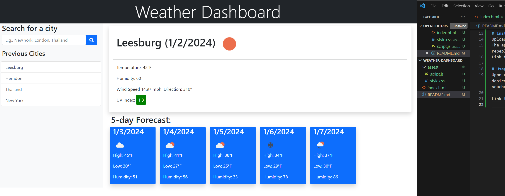

# Weather-Dashboard
A waterher dashboard that diaplays the weather outlook for multip;e cities using the OpenWeather API 

# Description
This appication is a single-page wather dashboard. It was created using HTML, CSS , Javascript ,Bootstrap Css Framework, jQuery and the font-awesome icon pack. The application uses JQuery AJAX calls o the open Weather API to obtain weather and UV informtion. This dasbard allows the user to in put a desired city, and will persent the user with current weather conditions as well as a five days forecast.

#Featuers
- Current weather coditions and five day forecast for the user to selecter a city
- UV index
- User can searches and saved in the localStorege
- The application will provide a warning to the user if the city entered into the search field doen not match a city in the Open Weater APl database

# Installtion 
Upload index.html, and assest foloder to the deployed webserver Javascript, Css files.
The appliction shown blow was deplayed using GitHub Pages. The repository can be replicated by via fork, clone , and repeployment with GitHub Pages.
Link to repostiory: https://github.com/KittiyaLooknam/Weather-Dashboard.git

# Usage
Upon accessing the applicatiom for the first time, the user will only be presented with a search field when they can enter their desired city. After the first secarch current weather 5 day forecast and the listing of previous serches will appear. The city seached will stored in the localstorage and wil be recalled the next time user accesses the application

Link to delpoyed instance of the application : https://git@github.com:KittiyaLooknam/Weather-Dashboard.git

# Referenced Utilized
https://openweathermap.org/api
https://developer.mozilla.org/en-US/docs/Web/JavaScript/Reference/Global_Objects/Date
https://api.jquery.com/deferred.then/

